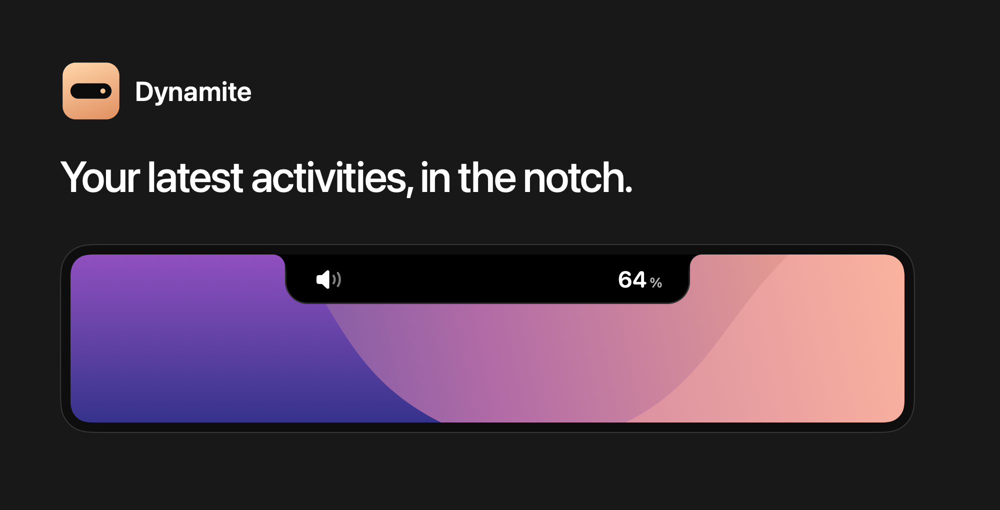
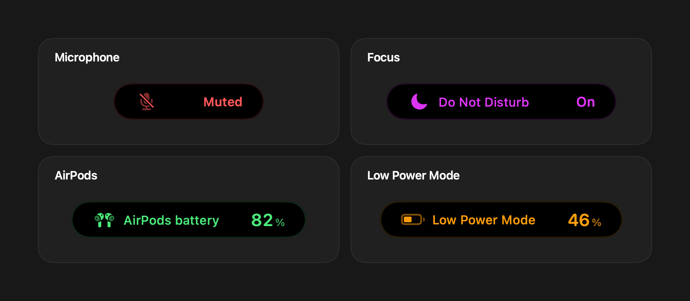
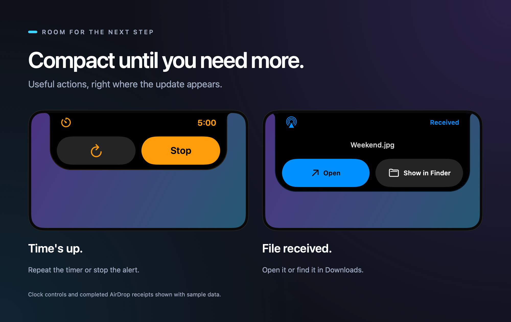

# Dynamite



Dynamite turns volume, brightness, Focus changes and other everyday status updates into compact, animated feedback. It stays focused on that job. No calendar dashboard, widgets or extra workspace to manage.

Built with SwiftUI and AppKit, with a floating pill for displays without a notch.

**Public beta · Apple Silicon · Locally signed, not notarized**

[Download the beta](https://github.com/the-shoemaker/Dynamite/releases) · [Report a problem](https://github.com/the-shoemaker/Dynamite/issues)

## What it does

- Volume and brightness feedback, including supported external displays and AirPods volume gestures.
- Microphone mute and unmute feedback for the default Mac input, including input volume set to zero.
- Caps Lock, charging, battery and Low Power Mode status.
- Focus changes, Bluetooth connections and real AirPods battery readings when available.
- Clock countdowns with pause/resume and expanded Repeat/Stop controls when a timer finishes.
- Completed AirDrop receipts with Open and Show in Finder.
- Adjustable durations from half a second to an hour, display previews, optional login startup and independent activity switches.

Dynamite hides recognized native popups when its replacement is available. Some integrations depend on private macOS interfaces, so replacement is not guaranteed on every system. AirDrop requests and transfer progress still use Apple's UI.





## Install

1. Download the ZIP from [Releases](https://github.com/the-shoemaker/Dynamite/releases) and unzip it.
2. Move **Dynamite.app** to **Applications** before launching or granting permissions.
3. Open it. This beta is not signed with an Apple Developer ID or notarized, so macOS may block the first launch.
4. If you trust this download, open **System Settings → Privacy & Security**, find the blocked-app message and choose **Open Anyway**, then confirm. See [Apple's instructions](https://support.apple.com/102445). A managed Mac may not allow this exception.
5. Follow Permission setup. Optional integrations can be enabled later from Settings → Integrations.

You do not need a paid developer account to use the app or grant its permissions. Do not disable Gatekeeper or SIP. If macOS reports malware or a damaged download rather than an unidentified developer, stop and report the exact message.

This archive contains an **Apple Silicon executable**. Intel Macs are not supported by this beta. The deployment minimum is macOS 14, but testing has been on macOS 27 beta; older macOS versions and a fresh second Mac still need verification.

## Permissions

| Access | Used for |
| --- | --- |
| Accessibility | Media-key replacement, Caps Lock observation, Clock controls and recognized native-popup handling. |
| Full Disk Access, optional | Reading the protected Focus state file. macOS grants broader access than this one file. |
| Downloads, optional | Detecting completed AirDrop files and offering file actions. File contents are not read. |
| Bluetooth, if macOS requests it | Accessory connection and battery status. |

Permissions belong to each Mac and user. They do not travel with the download. Setup checks current access and offers an optional Open at login switch. Reopen it in Integrations if needed. Microphone status uses Core Audio properties; Dynamite does not record microphone audio or follow a call app's independent mute button.

## Known issues and limits

- The Settings toolbar can briefly show an overflow button when expanding the sidebar. This visual issue is still being worked on.
- A native popup may flash before Dynamite hides it, particularly the first AirPods volume swipe. macOS updates can change popup ownership and behavior.
- Clock and Focus use undocumented state formats. Some Clock controls currently depend on English labels. Other languages need testing.
- AirDrop supports **completed files received in Downloads**, not incoming acceptance, live progress, outgoing transfers or items opened directly in another app.
- AirPods battery availability varies by model and firmware. Missing readings are omitted rather than guessed.
- External brightness depends on supported hardware and compatible MonitorControl profiles. Unsupported controls fall back to their existing handling.
- The low-battery reminder is additional feedback. Apple's critical-battery warning remains enabled.
- A local signature is not Apple notarization. Gatekeeper exceptions and privacy grants may need attention after a signing-identity change.

For a useful bug report, include your macOS version, Mac model, display setup, the affected activity and reproduction steps. Avoid posting device addresses, private filenames or unredacted notification screenshots.

Activities are grouped into collapsible sections. Macs without an internal battery hide battery activities and their previews; AirPods battery feedback remains available.

## Resource use

Dynamite is designed for low idle overhead. It uses native windows and event-driven observers where possible, with no web runtime. Animations and active integrations still consume CPU. Earlier local measurements are documented in [performance notes](docs/performance-2026-09-20.md); they are not a battery-life guarantee or a measurement of every Mac and workload.

Version 0.1.1 fixes a microphone observer loop that could cause high CPU use after extended runtime. See the [incident and verification notes](docs/microphone-idle-cpu-2026-09-22.md). Accelerated listener tests pass; full-day operation still needs verification.

## Updates

Release builds use Sparkle with an HTTPS feed and Ed25519-signed update archives. Check for Updates is in About; automatic checks are optional. The public verification key is included in the app, while the signing key stays in the maintainer's Keychain. Apple code signing and Sparkle update signing are separate.

The 0.1.0 → 0.1.1 download, verification, installation and relaunch were tested through Check for Updates on the development Mac using a copy of the published beta. A complete upgrade on a second Mac still needs testing. Manual downloads remain available in Releases.

## Build and test

Use macOS with Xcode or compatible Command Line Tools installed.

```sh
./scripts/test.sh
./scripts/build.sh
```

The app is written to `build/Dynamite.app`. Local builds without release configuration do not contact an update feed. `scripts/setup-signing.sh` can create a stable local development identity so rebuilding is less disruptive to Accessibility permissions. Never publish its private keychain or password.

The showcase images use the actual SwiftUI views with inert sample providers. Regenerate them with `./scripts/render-showcase.sh`; this does not start integrations or change the installed app.

See [release instructions](docs/releases.md), [architecture](docs/architecture.md) and [platform support](docs/platform-support.md) for details.

## License

Dynamite is released under the [WTFPL v2](LICENSE).

Sparkle is a separate dependency under its own license, included in the app as `Sparkle-LICENSE.txt`. Third-party license obligations remain applicable to those components.
